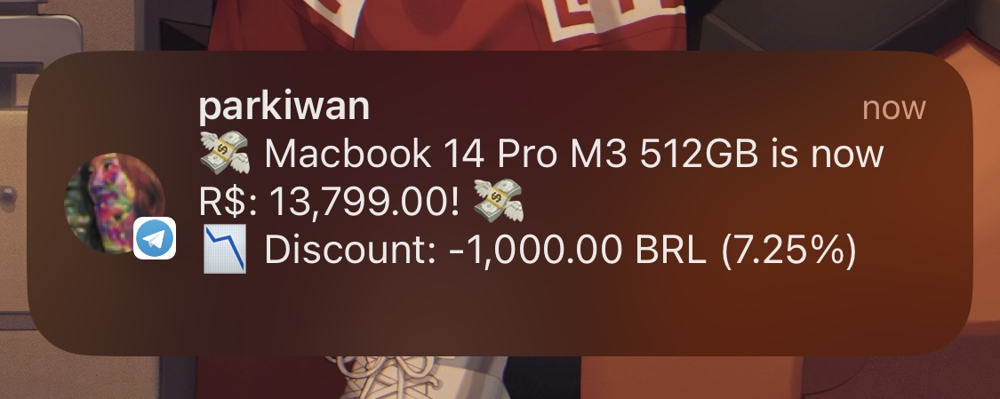

# Multiple Price Monitoring/Alerter
This app runs periodically, looks up for each given product in environment variable "PRODUCTS", and for every price drop, a notification is sent to interested users via a Telegram bot.

Github Actions runs every hour, and for any price change, a row is added to `./prices.csv` for future comparisons. 

Structure for "PRODUCTS":
```json
[
  {
    "product_name": "Macbook 14 Pro M3 512GB",
    "url": "https://www.goimports.com.br/Macs/macbook-pro/MacBook-Pro-14-M3-Pro-18GB-512GB-SSD",
    "alerts": { "telegram": ["1234567"] }
  },
  ...
]
```

A Telegram bot token (obtained from @botfather) must be set in "TELEGRAM_API_TOKEN" ambient variable.



Supported websites:
- www.goimports.com.br
- www.pontofrio.com.br
