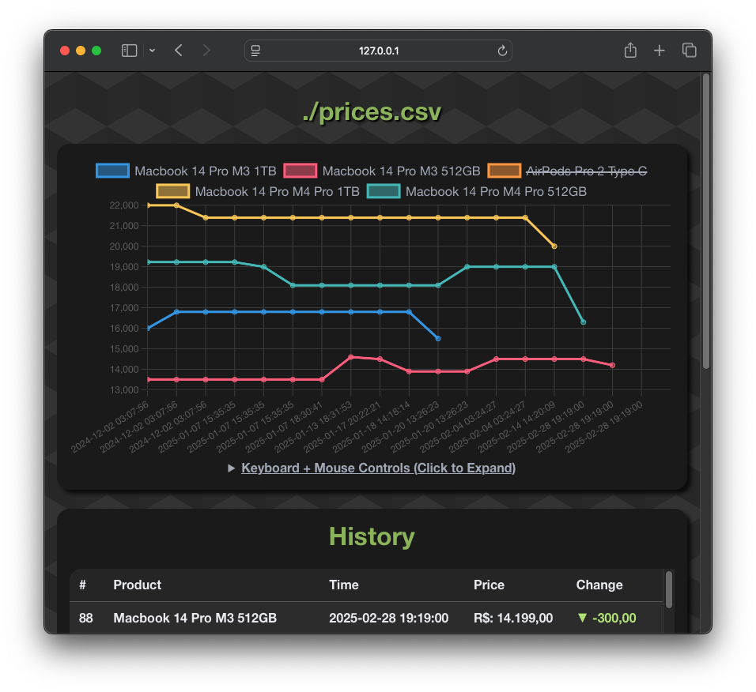
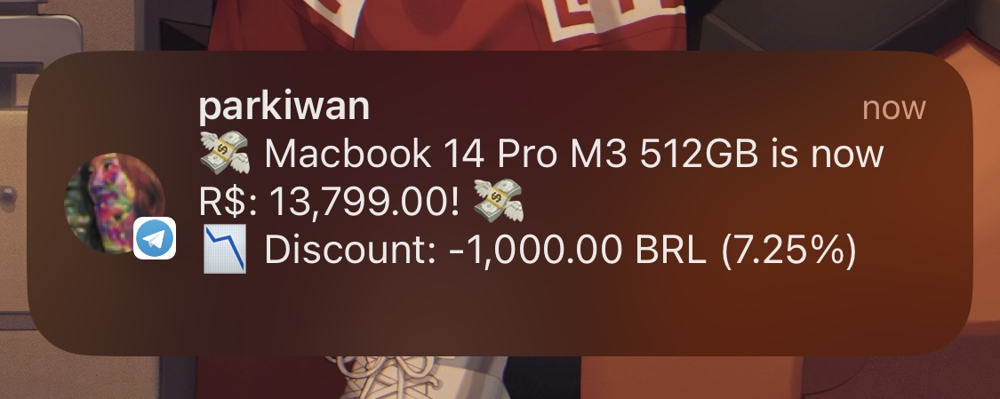

# Price Monitor/Alerter
This app runs hourly via Github Actions, and for any price change, a row is added to `./prices.csv` & commited for future comparisons. In case of discount, a notification is sent to interested users via a Telegram bot.

Visit the [awesome chart page](https://parklez.github.io/price-monitor-alerter/) for the historical data analysis 🤓☝️


### Telegram integration

The message sent by the Telegram bot while in lockscreen.

### Supported websites:
- www.goimports.com.br
- www.pontofrio.com.br
- www.angeloni.com.br
- www.lg.com
- www.dell.com

### Setup
This project needs 2 ambient variables in Github Actions's secrets.

- "`PRODUCTS`", which should follow the structure below:
```json
[
  {
    "product_name": "Macbook 14 Pro M3 512GB",
    "url": "https://www.goimports.com.br/Macs/macbook-pro/MacBook-Pro-14-M3-Pro-18GB-512GB-SSD",
    "alerts": { "telegram": ["1234567"] } // "alerts" is optional.
  },
  ...
]
```

- "`TELEGRAM_API_TOKEN`" - The Telegram bot token (obtained from @botfather).
